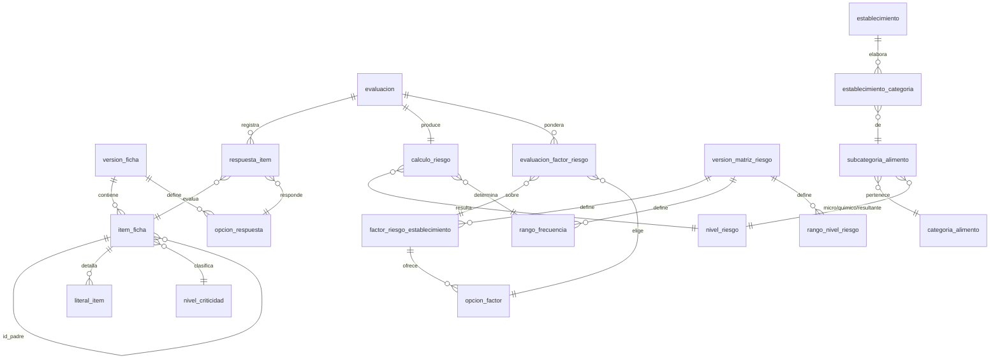
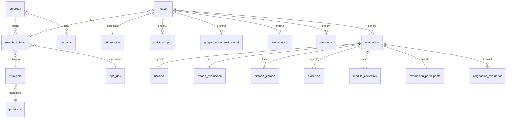

# Modelo de Datos — Sistema PWA de Evaluación Basada en Riesgo (EBR/BPM)

**Entregable para clase del jueves 20 de agosto de 2026**
**Fuentes normalizadas:** Ficha de Inspección BPM · Matriz de Riesgo de Alimentos · Hoja de Categorización de Establecimiento y Frecuencia de Inspección

---

## 1. Resumen ejecutivo

El modelo consta de **41 tablas** organizadas en 8 módulos. Se aplicó normalización hasta **3NF/BCNF** sobre las tres fuentes Excel, con **cinco desnormalizaciones deliberadas** documentadas y justificadas en §6.

Tres decisiones de diseño sostienen todo el modelo:

1. **La jerarquía de la ficha se resuelve con una tabla auto-referenciada**, no con una tabla por nivel. Soporta profundidad arbitraria sin cambios de esquema.
2. **Todo valor del motor de riesgo es dato, no código.** Los valores de C/CP/IT/N/A, los seis pesos de los factores y los rangos de frecuencia viven en tablas editables.
3. **Los catálogos son versionados y las evaluaciones congelan el valor aplicado.** Cambiar una constante mañana no altera ninguna evaluación histórica.

---

## 2. Análisis de normalización — Fuente 1: Matriz de Riesgo de Alimentos

### 2.1 Estructura original (no normalizada)

| CATEGORIA | SUBCATEGORIA | RIESGO MICROBIOLÓGICO | PUNTAJE | RIESGO QUÍMICO | PUNTAJE | RIESGO TOTAL |
|---|---|---|---|---|---|---|
| Productos lácteos | Productos lácteos líquidos no fermentados | BAJO | 2 | | | 2 |
| *(vacío)* | *(vacío)* | | #N/A | | | #N/A |
| Productos lácteos | Queso fresco pasteurizado | MEDIO | 4 | | | 4 |
| Frutas y Hortalizas | Frutas en conserva | BAJO | 2 | MEDIO | 4 | 3 |

110 filas · 17 categorías distintas.

### 2.2 Violación de 1NF — dependencia del orden de las filas

Las filas 3, 4 y 5 tienen `CATEGORIA` y `SUBCATEGORIA` vacías. En el Excel eso "se entiende" por celdas combinadas y por la posición de la fila. **Una relación no tiene orden**: si esas filas se reordenan, la información se pierde.

> **Corrección:** repetir el valor explícitamente en cada tupla durante la carga a *staging*. Las filas que queden sin categoría identificable se rechazan con motivo.

### 2.3 Violación de 3NF — dependencia transitiva del puntaje

La fórmula original es literalmente:

```
PUNTAJE = IFS(RIESGO="BAJO", 2, RIESGO="MEDIO", 4, RIESGO="ALTO", 8)
```

Con clave primaria `id_subcategoria`, tenemos:

```
id_subcategoria → riesgo_microbiologico → puntaje_microbiologico
```

`puntaje` **no depende de la subcategoría**; depende del nivel de riesgo, que es un atributo no clave. Es una dependencia transitiva pura: violación de 3NF.

**Anomalía concreta:** si la DIGEMAPS decide que MEDIO pasa de 4 a 5 puntos, hay que actualizar 13 filas. Si se actualizan 12, la base queda inconsistente y nada lo impide.

> **Corrección:** extraer la tabla `nivel_riesgo` con el puntaje como atributo propio. Las subcategorías referencian el nivel, no el número.

### 2.4 Violación de 3NF — atributo derivado almacenado

`RIESGO TOTAL = PROMEDIO(puntaje_micro, puntaje_quimico)` es un atributo calculable a partir de otros atributos de la misma tupla. Almacenarlo puede desincronizarse de sus insumos.

> **Decisión:** se almacena de todas formas, como desnormalización deliberada (§6, D-04). Justificación ahí.

### 2.5 Redundancia del nombre de categoría

"Productos lácteos" aparece 13 veces; "Cereales y productos a base de cereales, derivados de granos de cereal" aparece 11 veces con 68 caracteres cada vez.

**Anomalía de actualización:** corregir el nombre de una categoría exige tocar hasta 13 filas.
**Anomalía de inserción:** no se puede registrar una categoría nueva hasta que exista al menos una subcategoría suya.
**Anomalía de eliminación:** borrar la última subcategoría de "Alimentos preparados" borra también la existencia de esa categoría.

> **Corrección:** `categoria_alimento` como entidad propia con clave sustituta, referenciada por `subcategoria_alimento`.

### 2.6 Resultado normalizado

```
categoria_alimento (id, nombre, orden, activo)
        │ 1
        │
        │ N
subcategoria_alimento (id, categoria_id, nombre,
                       nivel_riesgo_microbiologico_id,
                       nivel_riesgo_quimico_id,
                       riesgo_total_calculado,
                       nivel_riesgo_resultante_id)
        │ N              │ N              │ N
        └────────────────┴────────────────┘
                         │ 1
                  nivel_riesgo (id, codigo, nombre,
                                puntaje_matriz,   -- 2 / 4 / 8
                                puntaje_rp,       -- 1 / 2 / 3
                                orden)
```

**La tabla `nivel_riesgo` resuelve el problema de las dos escalas.** El Excel de alimentos usa 2/4/8 y la hoja de frecuencia usa 1/2/3 para los mismos tres niveles conceptuales. En vez de tratarlas como escalas distintas, se modelan como **dos atributos del mismo nivel**. Un solo registro "ALTO" tiene `puntaje_matriz = 8` y `puntaje_rp = 3`.

> Esto responde parcialmente la pregunta A-01. Lo que sigue faltando es la regla que convierte el `riesgo_total_calculado` (rango 2–8) de vuelta a un nivel. Se modela como tabla configurable — ver §5.3.

---

## 3. Análisis de normalización — Fuente 2: Hoja de Frecuencia de Inspección

### 3.1 Estructura original

Es un **formulario, no una tabla**. Mezcla en una sola hoja: (a) catálogo de niveles de riesgo, (b) los 6 factores con sus pesos, (c) las opciones de cada factor, (d) la respuesta del establecimiento evaluado, (e) los cálculos intermedios, (f) la matriz de frecuencia.

Seis conceptos distintos conviviendo en una hoja es la violación de fondo: **no hay separación entre catálogo y transacción**.

### 3.2 Violación de 1NF — grupo repetitivo

Los 6 factores están dispuestos como filas fijas del formulario, cada una con su opción elegida embebida. Agregar un séptimo factor exige **modificar la estructura de la hoja y todas las fórmulas**. Ese es el síntoma clásico de un grupo repetitivo no normalizado.

> **Corrección:** `factor_riesgo_establecimiento` como filas de una tabla. Agregar un factor pasa a ser un `INSERT`.

### 3.3 Violación de 3NF — el puntaje depende de la opción

```
=IF(L22="Grande (>2.000.000 por mes)", 3,
 IF(L22="Mediano (800.000 - 2.000.000 por mes)", 2.33,
 IF(L22="Pequeño (200.000 - 800.000 por mes)", 1.67,
 IF(L22="Micro (<200.000 por mes)", 1, ""))))
```

El puntaje no depende del establecimiento ni del factor: depende de **la opción seleccionada**. Y las opciones están codificadas como cadenas de texto dentro de una fórmula, no como datos.

**Este es exactamente el origen del defecto D-01.** La celda del factor 6 contiene *"Plan de muestreo en materias primas"* pero la fórmula compara contra *"Tiene plan de muestreo microbiológico solo para las materias primas"*. Ninguna condición coincide, el `IF` cae hasta el final y devuelve `FALSE`. El factor aportó 0 en vez de 0.1864.

> **Un modelo relacional hace ese error imposible.** Con `opcion_factor` como tabla y una clave foránea, no existe la posibilidad de seleccionar un texto que no esté en el catálogo. La integridad referencial elimina toda una clase de bugs.

### 3.4 Violación de 3NF — atributos derivados

- `valor_factor = puntaje × peso` — derivado
- `RE = Σ valor_factor` — derivado
- `RT = RP × RE` — derivado
- `frecuencia` — derivada de RT vía la matriz de rangos

> **Decisión:** se almacenan en `calculo_riesgo` y `evaluacion_factor_riesgo` como desnormalización deliberada (§6, D-02 y D-03).

### 3.5 Mezcla de catálogo y transacción

La columna "Categoría riesgo" contiene **la respuesta del establecimiento que se está evaluando**, mientras que las columnas de la derecha contienen **el catálogo de opciones posibles**. Son dos entidades con ciclos de vida completamente distintos: el catálogo cambia cuando cambia la norma; la respuesta cambia en cada inspección.

> **Corrección:** separar `opcion_factor` (catálogo, estable) de `evaluacion_factor_riesgo` (transacción, una fila por factor por evaluación).

### 3.6 Resultado normalizado

```
version_matriz_riesgo (id, numero_version, fecha_vigencia_desde, estado)
        │ 1
        │ N
factor_riesgo_establecimiento (id, version_matriz_id, numero, nombre, peso, orden)
        │ 1
        │ N
opcion_factor (id, factor_id, descripcion, puntaje, orden)
        │ 1
        │ N
evaluacion_factor_riesgo (id, evaluacion_id, factor_id, opcion_factor_id,
                          puntaje_aplicado, peso_aplicado, aporte)

rango_frecuencia (id, version_matriz_id, limite_inferior, limite_superior,
                  nivel_riesgo_id, frecuencia, meses_hasta_proxima)
```

**Restricción de integridad crítica:** los pesos de los 6 factores deben sumar exactamente 1.00. Se valida con un *trigger*, no con confianza.

---

## 4. Análisis de normalización — Fuente 3: Ficha de Inspección BPM

### 4.1 Violación de 1NF — jerarquía codificada en la presentación

El nivel de cada ítem se comunica de dos formas, **ninguna de ellas un dato**:

1. La **columna** donde está el texto (columna A = nivel 1-2, B = nivel 3, C = literal)
2. La **cadena de numeración** `"1.1.3.2"`

La estructura del árbol es información. Está ahí, pero codificada en el formato visual y en un atributo compuesto no atómico.

> **Corrección:** `item_ficha.id_padre` como clave foránea recursiva. La jerarquía pasa a ser una relación explícita.

### 4.2 Violación de 1NF — un atributo repartido en cuatro columnas

La respuesta se marca en cuatro columnas booleanas: `C`, `CP`, `IT`, `N/A`. Conceptualmente hay **un solo atributo** ("respuesta del inspector") con cuatro valores posibles.

**Anomalía:** nada impide marcar simultáneamente `C` y `IT`. El Excel lo permite y la fórmula `IFS` simplemente toma la primera que encuentra, en silencio.

> **Corrección:** un atributo `opcion_respuesta_id` con clave foránea a un catálogo de 4 filas. Marcar dos opciones se vuelve imposible.

### 4.3 Violación de 1NF — grupos repetitivos

| Grupo repetitivo | Ubicación | Corrección |
|---|---|---|
| Medidas correctivas numeradas 1 a 10 | Filas fijas al pie de la ficha | Tabla hija `medida_correctiva`, sin límite artificial de 10 |
| Número de empleados M / F | Dos columnas separadas | Tabla `establecimiento_empleado` por sexo, o dos atributos si el dominio es fijo |
| Contactos: propietario y representante, cada uno con nombre/cédula/teléfono/correo | Bloques duplicados | Tabla `contacto` con `tipo_contacto_id` |
| Categorías de alimento que elabora | Celda de texto libre | Tabla puente `establecimiento_categoria` |
| 2 oficiales DPS/DAS + 2 técnicos DIGEMAPS | Cuatro filas fijas | Tabla `evaluacion_participante` con rol |

### 4.4 Violación de 3NF — subtotales almacenados como filas

Hay 33 filas `SUB TOTAL` con fórmulas `=SUM(...)`. Son agregados de datos que ya existen, mezclados como si fueran datos base.

> **Corrección:** no se almacenan. Se calculan en consulta con una CTE recursiva que agrega hacia arriba en el árbol.

### 4.5 El debate central: ¿una tabla por nivel o una tabla auto-referenciada?

En clase se propuso una tabla por nivel de jerarquía. La profesora respondió preguntando *"¿cuál sería la solución más sencilla?"* y advirtió que **la estructura debe permitir agregar o modificar registros de cualquier nivel**.

**Estructura real medida en el archivo:** 7 nodos de nivel 1, 14 de nivel 2, 18 de nivel 3, 6 de nivel 4.

| Criterio | Una tabla por nivel | Tabla auto-referenciada |
|---|---|---|
| Tablas necesarias | 4 hoy, N mañana | 1, siempre |
| Agregar un nivel 5 | Cambio de esquema + migración + código | `INSERT` |
| Consultar el árbol completo | 4 `JOIN` encadenados, reescritos si cambia la profundidad | Una CTE recursiva, invariante |
| Recorrer subtotales | Lógica distinta por nivel | Un solo algoritmo recursivo |
| Mover un ítem de nivel | Borrar de una tabla e insertar en otra | `UPDATE id_padre` |
| Integridad referencial | Se rompe al mover entre tablas | Se mantiene |

**Conclusión: tabla auto-referenciada.** El argumento decisivo no es la elegancia: es que la profundidad de la ficha **no es un dato conocido y estable**. La revisión de octubre 2024 llega a 4 niveles; la próxima revisión de la norma podría llegar a 5. Un esquema que exige migración cada vez que cambia la norma no cumple el requisito de administrabilidad.

**Contraargumento honesto:** la tabla auto-referenciada obliga a validar por aplicación cosas que un esquema por niveles garantizaría estructuralmente — por ejemplo, que un ítem no sea su propio ancestro. Se mitiga con una restricción `CHECK (id != id_padre)` más validación de ciclos en el servicio. Es un intercambio consciente, no un descuido.

---

## 5. Modelo lógico

### 5.1 Diagrama del núcleo — la cadena del motor de riesgo



### 5.2 Diagrama de casos y evaluación



### 5.3 Tratamiento de la ambigüedad A-01

Falta la regla que convierte el `riesgo_total_calculado` de la matriz (rango 2–8) en un nivel Bajo/Medio/Alto. **No se resuelve adivinando: se modela como tabla configurable.**

```
rango_nivel_riesgo (id, version_matriz_id, limite_inferior, limite_superior, nivel_riesgo_id)
```

Se carga con un supuesto inicial documentado (`2.0–2.9 → BAJO · 3.0–5.9 → MEDIO · 6.0–8.0 → ALTO`) marcado explícitamente como supuesto. Cuando la profesora responda, es un `UPDATE` de tres filas, no un cambio de código.

> **Argumento para clase:** convertir una pregunta abierta en un parámetro configurable es preferible a bloquear el desarrollo esperando la respuesta, y también a hardcodear una suposición que después hay que ir a buscar entre el código.

---

## 6. Desnormalizaciones deliberadas

Cinco atributos violan 3NF de forma consciente. Cada uno con su justificación — un modelo que desnormaliza sin declararlo es un modelo mal hecho; uno que lo declara y lo argumenta es un modelo maduro.

| # | Atributo | Regla que viola | Justificación |
|---|---|---|---|
| **D-01** | `respuesta_item.valor_aplicado` | Derivable de `opcion_respuesta.valor` | **Persistencia histórica.** Requisito explícito de la profesora: *"lo que ya yo hice con la imputación anterior tiene que permanecer"*. Si mañana CP pasa de 0.5 a 0.6, las evaluaciones cerradas deben conservar su cálculo. Sin este atributo habría que reconstruir el valor navegando el versionado en cada consulta histórica, y cualquier error de versionado corrompería años de datos. |
| **D-02** | `evaluacion_factor_riesgo.puntaje_aplicado`, `peso_aplicado`, `aporte` | Derivables del catálogo | **Misma razón + auditabilidad.** Permite responder "¿de dónde salió ese RE de 1.2067?" con una sola consulta, sin recalcular. |
| **D-03** | Todo `calculo_riesgo` | Todos derivados | **Snapshot inmutable del resultado legal.** Es el número con el que se programa una inspección oficial. Debe ser reproducible aunque cambien los catálogos, y consultable sin recorrer 45 respuestas. |
| **D-04** | `subcategoria_alimento.riesgo_total_calculado` | Derivable del promedio | Es el valor **importado** del Excel. Conservarlo permite comparar contra el valor recalculado y detectar discrepancias en la carga (defectos D-02 y D-03 del archivo original). |
| **D-05** | `item_ficha.numeracion` | Derivable recorriendo `id_padre` | Es el **identificador legal** que aparece en la ficha en papel y con el que el inspector se comunica ("no cumple el 1.1.3.2"). Calcularlo recursivamente en cada render de 45 ítems es costo innecesario en un dispositivo móvil sin conexión. |

**Regla que se aplica a las cinco:** el valor desnormalizado se escribe **una sola vez**, en el momento de la transacción, y nunca se actualiza. No son cachés — son registros históricos. Un caché desactualizado es un bug; un registro histórico desactualizado es exactamente lo que se busca.

---

## 7. DDL — PostgreSQL

Se incluyen las tablas del núcleo. El script completo va en `/db/schema.sql`.

### 7.1 Catálogo de riesgo

```sql
CREATE TABLE nivel_riesgo (
    id              SMALLSERIAL PRIMARY KEY,
    codigo          VARCHAR(10)  NOT NULL UNIQUE,   -- BAJO | MEDIO | ALTO
    nombre          VARCHAR(50)  NOT NULL,
    puntaje_matriz  NUMERIC(4,2) NOT NULL,          -- 2 | 4 | 8   (matriz de alimentos)
    puntaje_rp      NUMERIC(4,2) NOT NULL,          -- 1 | 2 | 3   (riesgo del producto)
    orden           SMALLINT     NOT NULL,
    activo          BOOLEAN      NOT NULL DEFAULT TRUE
);
COMMENT ON COLUMN nivel_riesgo.puntaje_matriz IS
  'Escala de la Matriz de Riesgo de Alimentos. Fuente: Matriz_Riesgo_Alimentos.xlsx, fórmula IFS col. D';
COMMENT ON COLUMN nivel_riesgo.puntaje_rp IS
  'Escala del Riesgo del Producto. Fuente: Hoja Frecuencia Inspección, filas 14-16';

CREATE TABLE categoria_alimento (
    id      SERIAL PRIMARY KEY,
    nombre  VARCHAR(200) NOT NULL UNIQUE,
    orden   SMALLINT     NOT NULL DEFAULT 0,
    activo  BOOLEAN      NOT NULL DEFAULT TRUE
);

CREATE TABLE subcategoria_alimento (
    id                              SERIAL PRIMARY KEY,
    categoria_id                    INT NOT NULL REFERENCES categoria_alimento(id),
    nombre                          VARCHAR(400) NOT NULL,
    nivel_riesgo_microbiologico_id  SMALLINT REFERENCES nivel_riesgo(id),
    nivel_riesgo_quimico_id         SMALLINT REFERENCES nivel_riesgo(id),
    riesgo_total_calculado          NUMERIC(5,2),          -- desnormalización D-04
    nivel_riesgo_resultante_id      SMALLINT REFERENCES nivel_riesgo(id),
    requiere_revision               BOOLEAN NOT NULL DEFAULT FALSE,
    activo                          BOOLEAN NOT NULL DEFAULT TRUE,
    CONSTRAINT uq_subcat UNIQUE (categoria_id, nombre)
);
COMMENT ON COLUMN subcategoria_alimento.requiere_revision IS
  'TRUE en las 3 subcategorías de Frutas y Hortalizas sin nivel de riesgo asignado (defecto D-03 del archivo fuente)';
```

### 7.2 Versionado de la matriz y factores

```sql
CREATE TABLE version_matriz_riesgo (
    id                    SERIAL PRIMARY KEY,
    numero_version        VARCHAR(20) NOT NULL,
    nombre                VARCHAR(150) NOT NULL,
    fecha_vigencia_desde  DATE NOT NULL,
    fecha_vigencia_hasta  DATE,
    estado                VARCHAR(15) NOT NULL DEFAULT 'BORRADOR'
                          CHECK (estado IN ('BORRADOR','PUBLICADA','ARCHIVADA')),
    usuario_publica_id    INT,
    fecha_publicacion     TIMESTAMPTZ
);

CREATE TABLE factor_riesgo_establecimiento (
    id                  SERIAL PRIMARY KEY,
    version_matriz_id   INT NOT NULL REFERENCES version_matriz_riesgo(id),
    numero              SMALLINT NOT NULL,
    nombre              VARCHAR(200) NOT NULL,
    peso                NUMERIC(5,4) NOT NULL CHECK (peso > 0 AND peso <= 1),
    es_automatico       BOOLEAN NOT NULL DEFAULT FALSE,
    fuente_automatica   VARCHAR(50),
    orden               SMALLINT NOT NULL,
    CONSTRAINT uq_factor UNIQUE (version_matriz_id, numero)
);
COMMENT ON COLUMN factor_riesgo_establecimiento.es_automatico IS
  'TRUE en el factor 3 (Cumplimiento BPM): su opción se deriva del % de cumplimiento de la evaluación, no se digita';

CREATE TABLE opcion_factor (
    id           SERIAL PRIMARY KEY,
    factor_id    INT NOT NULL REFERENCES factor_riesgo_establecimiento(id),
    descripcion  VARCHAR(300) NOT NULL,
    puntaje      NUMERIC(4,2) NOT NULL CHECK (puntaje BETWEEN 1 AND 3),
    limite_inf   NUMERIC(6,2),   -- para el factor 3, que mapea desde un porcentaje
    limite_sup   NUMERIC(6,2),
    orden        SMALLINT NOT NULL
);

-- Los pesos de una versión deben sumar exactamente 1.00
CREATE OR REPLACE FUNCTION fn_validar_suma_pesos() RETURNS TRIGGER AS $$
DECLARE total NUMERIC(6,4);
BEGIN
    SELECT COALESCE(SUM(peso),0) INTO total
      FROM factor_riesgo_establecimiento
     WHERE version_matriz_id = COALESCE(NEW.version_matriz_id, OLD.version_matriz_id);
    IF total > 1.0001 THEN
        RAISE EXCEPTION 'La suma de pesos (%) excede 1.00', total;
    END IF;
    RETURN NEW;
END; $$ LANGUAGE plpgsql;

CREATE TRIGGER trg_validar_pesos
AFTER INSERT OR UPDATE OR DELETE ON factor_riesgo_establecimiento
FOR EACH ROW EXECUTE FUNCTION fn_validar_suma_pesos();

CREATE TABLE rango_frecuencia (
    id                    SERIAL PRIMARY KEY,
    version_matriz_id     INT NOT NULL REFERENCES version_matriz_riesgo(id),
    limite_inferior       NUMERIC(5,2) NOT NULL,
    limite_superior       NUMERIC(5,2),
    incluye_inferior      BOOLEAN NOT NULL DEFAULT TRUE,
    incluye_superior      BOOLEAN NOT NULL DEFAULT TRUE,
    nivel_riesgo_id       SMALLINT NOT NULL REFERENCES nivel_riesgo(id),
    frecuencia            VARCHAR(20) NOT NULL,   -- Anual | Semestral | Trimestral
    meses_hasta_proxima   SMALLINT NOT NULL       -- 12 | 6 | 3
);

CREATE TABLE rango_nivel_riesgo (   -- resuelve la ambigüedad A-01 como dato
    id                 SERIAL PRIMARY KEY,
    version_matriz_id  INT NOT NULL REFERENCES version_matriz_riesgo(id),
    limite_inferior    NUMERIC(5,2) NOT NULL,
    limite_superior    NUMERIC(5,2) NOT NULL,
    nivel_riesgo_id    SMALLINT NOT NULL REFERENCES nivel_riesgo(id),
    es_supuesto        BOOLEAN NOT NULL DEFAULT FALSE
);
COMMENT ON TABLE rango_nivel_riesgo IS
  'Convierte el riesgo total de la matriz (escala 2-8) a nivel Bajo/Medio/Alto. La regla NO está en los archivos fuente; es_supuesto=TRUE mientras no la confirme la DIGEMAPS';
```

### 7.3 Catálogo de la ficha — la jerarquía

```sql
CREATE TABLE version_ficha (
    id                            SERIAL PRIMARY KEY,
    numero_version                VARCHAR(20) NOT NULL,
    nombre                        VARCHAR(200) NOT NULL,
    fecha_vigencia_desde          DATE NOT NULL,
    fecha_vigencia_hasta          DATE,
    estado                        VARCHAR(15) NOT NULL DEFAULT 'BORRADOR'
                                  CHECK (estado IN ('BORRADOR','PUBLICADA','ARCHIVADA')),
    total_items_evaluables        SMALLINT NOT NULL DEFAULT 0,
    puntaje_total_posible         NUMERIC(6,2) NOT NULL DEFAULT 0,
    -- Regla de aprobación, versionada junto a la ficha
    porcentaje_minimo_aprobacion  NUMERIC(5,2) NOT NULL DEFAULT 60,
    max_nc_criticas               SMALLINT     NOT NULL DEFAULT 1,
    max_nc_mayores                SMALLINT     NOT NULL DEFAULT 5,
    porcentaje_permiso_sanitario  NUMERIC(5,2) NOT NULL DEFAULT 81,
    usuario_publica_id            INT,
    fecha_publicacion             TIMESTAMPTZ
);

CREATE TABLE nivel_criticidad (
    id      SMALLSERIAL PRIMARY KEY,
    codigo  CHAR(2) NOT NULL UNIQUE,       -- C | M | Me
    nombre  VARCHAR(40) NOT NULL,          -- Crítica | Mayor | Menor
    orden   SMALLINT NOT NULL
);

CREATE TABLE item_ficha (
    id               SERIAL PRIMARY KEY,
    version_ficha_id INT NOT NULL REFERENCES version_ficha(id),
    id_padre         INT REFERENCES item_ficha(id),
    numeracion       VARCHAR(20)  NOT NULL,       -- desnormalización D-05
    titulo           TEXT         NOT NULL,
    nivel            SMALLINT     NOT NULL,
    orden            SMALLINT     NOT NULL,
    es_evaluable     BOOLEAN      NOT NULL DEFAULT FALSE,
    peso             NUMERIC(5,2) NOT NULL DEFAULT 1.00,
    criticidad_id    SMALLINT     REFERENCES nivel_criticidad(id),
    activo           BOOLEAN      NOT NULL DEFAULT TRUE,
    CONSTRAINT ck_no_autopadre  CHECK (id_padre IS NULL OR id_padre <> id),
    CONSTRAINT ck_peso_positivo CHECK (peso > 0),
    CONSTRAINT uq_numeracion    UNIQUE (version_ficha_id, numeracion)
);
CREATE INDEX ix_item_padre ON item_ficha(id_padre);
CREATE INDEX ix_item_eval  ON item_ficha(version_ficha_id) WHERE es_evaluable;

COMMENT ON COLUMN item_ficha.peso IS
  'Hoy 1.00 en los 45 ítems. Existe porque la DIGEMAPS pidió poder aumentar o reducir el valor de una pregunta sin cambiar el sistema';

CREATE TABLE literal_item (
    id            SERIAL PRIMARY KEY,
    item_ficha_id INT NOT NULL REFERENCES item_ficha(id) ON DELETE CASCADE,
    letra         VARCHAR(5),
    texto         TEXT NOT NULL,
    orden         SMALLINT NOT NULL
);

CREATE TABLE opcion_respuesta (
    id                   SMALLSERIAL PRIMARY KEY,
    version_ficha_id     INT NOT NULL REFERENCES version_ficha(id),
    codigo               VARCHAR(5)   NOT NULL,   -- C | CP | IT | N/A
    nombre               VARCHAR(50)  NOT NULL,
    valor                NUMERIC(5,2) NOT NULL,   -- 1.0 | 0.5 | 0.0 | 0.0
    excluye_del_calculo  BOOLEAN      NOT NULL DEFAULT FALSE,
    genera_nc            BOOLEAN      NOT NULL DEFAULT FALSE,
    orden                SMALLINT     NOT NULL,
    CONSTRAINT uq_opcion UNIQUE (version_ficha_id, codigo)
);
COMMENT ON COLUMN opcion_respuesta.excluye_del_calculo IS
  'TRUE solo en N/A. Saca el ítem del DENOMINADOR, no lo cuenta como cero';
COMMENT ON COLUMN opcion_respuesta.genera_nc IS
  'TRUE en CP e IT: la respuesta produce una No Conformidad cuya severidad la da item_ficha.criticidad_id';
```

### 7.4 Evaluación y cálculo

```sql
CREATE TABLE evaluacion (
    id                    SERIAL PRIMARY KEY,
    uuid_local            UUID NOT NULL UNIQUE,          -- idempotencia offline
    caso_id               INT NOT NULL REFERENCES caso(id),
    establecimiento_id    INT NOT NULL REFERENCES establecimiento(id),
    evaluador_id          INT NOT NULL REFERENCES usuario(id),
    version_ficha_id      INT NOT NULL REFERENCES version_ficha(id),
    version_matriz_id     INT NOT NULL REFERENCES version_matriz_riesgo(id),
    estado_id             SMALLINT NOT NULL REFERENCES estado_evaluacion(id),
    fecha_programada      DATE,
    fecha_inicio          TIMESTAMPTZ,
    fecha_finalizacion    TIMESTAMPTZ,
    fecha_envio           TIMESTAMPTZ,
    bloqueada             BOOLEAN NOT NULL DEFAULT FALSE,
    version_registro      INT NOT NULL DEFAULT 1,        -- control de concurrencia
    latitud               NUMERIC(10,7),
    longitud              NUMERIC(10,7)
);

CREATE TABLE respuesta_item (
    id                   BIGSERIAL PRIMARY KEY,
    uuid_local           UUID NOT NULL UNIQUE,
    evaluacion_id        INT NOT NULL REFERENCES evaluacion(id) ON DELETE CASCADE,
    item_ficha_id        INT NOT NULL REFERENCES item_ficha(id),
    opcion_respuesta_id  SMALLINT NOT NULL REFERENCES opcion_respuesta(id),
    valor_aplicado       NUMERIC(5,2) NOT NULL,          -- desnormalización D-01
    peso_aplicado        NUMERIC(5,2) NOT NULL,          -- desnormalización D-01
    excluido_del_calculo BOOLEAN NOT NULL,
    criticidad_id        SMALLINT REFERENCES nivel_criticidad(id),
    observacion          TEXT,
    fecha_captura        TIMESTAMPTZ NOT NULL DEFAULT NOW(),
    sincronizado         BOOLEAN NOT NULL DEFAULT FALSE,
    CONSTRAINT uq_respuesta UNIQUE (evaluacion_id, item_ficha_id)
);

CREATE TABLE evaluacion_factor_riesgo (
    id                SERIAL PRIMARY KEY,
    evaluacion_id     INT NOT NULL REFERENCES evaluacion(id) ON DELETE CASCADE,
    factor_id         INT NOT NULL REFERENCES factor_riesgo_establecimiento(id),
    opcion_factor_id  INT NOT NULL REFERENCES opcion_factor(id),
    puntaje_aplicado  NUMERIC(4,2) NOT NULL,             -- desnormalización D-02
    peso_aplicado     NUMERIC(5,4) NOT NULL,             -- desnormalización D-02
    aporte            NUMERIC(6,4) NOT NULL,             -- puntaje × peso
    CONSTRAINT uq_eval_factor UNIQUE (evaluacion_id, factor_id)
);

CREATE TABLE calculo_riesgo (                            -- desnormalización D-03
    id                        SERIAL PRIMARY KEY,
    evaluacion_id             INT NOT NULL UNIQUE REFERENCES evaluacion(id),
    -- Cumplimiento
    puntos_obtenidos          NUMERIC(6,2) NOT NULL,
    puntos_excluidos_na       NUMERIC(6,2) NOT NULL,
    puntaje_total_posible     NUMERIC(6,2) NOT NULL,
    denominador_efectivo      NUMERIC(6,2) NOT NULL,     -- total − excluidos
    porcentaje_cumplimiento   NUMERIC(5,2) NOT NULL,
    -- No conformidades
    nc_criticas               SMALLINT NOT NULL DEFAULT 0,
    nc_mayores                SMALLINT NOT NULL DEFAULT 0,
    nc_menores                SMALLINT NOT NULL DEFAULT 0,
    calificacion_texto        VARCHAR(120) NOT NULL,
    aprueba                   BOOLEAN NOT NULL,
    otorga_permiso_sanitario  BOOLEAN NOT NULL DEFAULT FALSE,
    -- Motor de riesgo
    rp_valor                  NUMERIC(4,2) NOT NULL,
    rp_subcategoria_id        INT REFERENCES subcategoria_alimento(id),
    re_valor                  NUMERIC(6,4) NOT NULL,
    re_detalle                JSONB NOT NULL,
    rt_valor                  NUMERIC(6,4) NOT NULL,
    nivel_riesgo_id           SMALLINT NOT NULL REFERENCES nivel_riesgo(id),
    rango_frecuencia_id       INT NOT NULL REFERENCES rango_frecuencia(id),
    frecuencia                VARCHAR(20) NOT NULL,
    fecha_proxima_inspeccion  DATE NOT NULL,
    -- Trazabilidad
    version_ficha_id          INT NOT NULL REFERENCES version_ficha(id),
    version_matriz_id         INT NOT NULL REFERENCES version_matriz_riesgo(id),
    fecha_calculo             TIMESTAMPTZ NOT NULL DEFAULT NOW(),
    CONSTRAINT ck_denominador CHECK (denominador_efectivo > 0)
);
COMMENT ON COLUMN calculo_riesgo.rp_subcategoria_id IS
  'Subcategoría que determinó el RP por ser la de mayor riesgo entre las que elabora el establecimiento';
COMMENT ON COLUMN calculo_riesgo.re_detalle IS
  'Desglose de los 6 factores: [{factor, opcion, puntaje, peso, aporte}]. Permite auditar el RE sin recalcular';
```

### 7.5 Consulta del árbol con CTE recursiva

Esta es la consulta que hace innecesarias las cuatro tablas por nivel:

```sql
WITH RECURSIVE arbol AS (
    SELECT id, id_padre, numeracion, titulo, nivel, orden,
           es_evaluable, peso,
           ARRAY[orden] AS ruta
      FROM item_ficha
     WHERE version_ficha_id = $1 AND id_padre IS NULL

    UNION ALL

    SELECT h.id, h.id_padre, h.numeracion, h.titulo, h.nivel, h.orden,
           h.es_evaluable, h.peso,
           a.ruta || h.orden
      FROM item_ficha h
      JOIN arbol a ON h.id_padre = a.id
     WHERE h.activo
)
SELECT * FROM arbol ORDER BY ruta;
```

Y el cálculo del porcentaje con exclusión correcta de N/A:

```sql
SELECT
    SUM(CASE WHEN NOT r.excluido_del_calculo
             THEN r.valor_aplicado * r.peso_aplicado ELSE 0 END)          AS puntos_obtenidos,
    SUM(CASE WHEN r.excluido_del_calculo
             THEN r.peso_aplicado ELSE 0 END)                             AS puntos_excluidos,
    SUM(r.peso_aplicado)                                                  AS total_posible,
    ROUND(
        SUM(CASE WHEN NOT r.excluido_del_calculo
                 THEN r.valor_aplicado * r.peso_aplicado ELSE 0 END)
        / NULLIF(SUM(CASE WHEN NOT r.excluido_del_calculo
                          THEN r.peso_aplicado ELSE 0 END), 0) * 100
    , 2)                                                                  AS porcentaje
FROM respuesta_item r
WHERE r.evaluacion_id = $1;
```

> El `NULLIF(..., 0)` cubre el caso extremo en que **todos** los ítems se marquen N/A. Sin él, división por cero.

---

## 8. Estrategia de importación de los Excel

La profesora fue explícita: *"el programa lo tiene que importar. Ahora, tú tienes que crear estructuras para tener los datos que tienes en el Excel."*

**Tres pasos, iguales para las tres fuentes:**

**Paso 1 — Staging plano.** El Excel se carga tal cual a `stg_matriz_alimentos`, `stg_ficha_bpm`, `stg_factores`, sin normalizar, conservando `fila_origen`. Nada se rechaza todavía.

**Paso 2 — Normalización.** Se extraen las entidades distintas y se generan sus claves sustitutas, y después se resuelven las foráneas por nombre:

```sql
-- 2a: extraer las 17 categorías distintas de 110 filas repetidas
INSERT INTO categoria_alimento (nombre)
SELECT DISTINCT TRIM(categoria) FROM stg_matriz_alimentos
WHERE categoria IS NOT NULL
ON CONFLICT (nombre) DO NOTHING;

-- 2b: enlazar cada subcategoría a su categoría por el nombre
INSERT INTO subcategoria_alimento (categoria_id, nombre,
                                   nivel_riesgo_microbiologico_id,
                                   nivel_riesgo_quimico_id)
SELECT c.id, TRIM(s.subcategoria), nm.id, nq.id
  FROM stg_matriz_alimentos s
  JOIN categoria_alimento c ON c.nombre = TRIM(s.categoria)
  LEFT JOIN nivel_riesgo nm ON nm.codigo = TRIM(s.riesgo_microbiologico)
  LEFT JOIN nivel_riesgo nq ON nq.codigo = TRIM(s.riesgo_quimico)
 WHERE s.subcategoria IS NOT NULL;
```

> Este es exactamente el razonamiento que la profesora estaba forzando en clase: *"yo sigo teniendo la categoría con el nombre y la subcategoría con el nombre. Yo tengo que asociar este nombre con el código de la categoría."* El paso 2a genera los IDs; el 2b hace el `JOIN` por nombre para resolver la foránea.

**Paso 3 — Validación y reporte.** Las filas que no pasan se registran con su motivo en `importacion_detalle`. Los defectos D-02 y D-03 del archivo original salen aquí de forma automática, no por revisión manual.

**Caso especial — la jerarquía de la ficha:** se importa en dos pasadas. Primero se insertan los 45 ítems con su `numeracion` y `id_padre` nulo; después se resuelve el padre calculándolo desde la numeración (el padre de `1.1.3.2` es `1.1.3`). Es más robusto que intentar resolverlo en una sola pasada, porque no depende del orden de las filas del Excel.

---

## 9. Opiniones para defender en clase

Posiciones argumentadas. Algunas son discutibles a propósito — conviene llevarlas sabiendo cuál es el contraargumento.

### 9.1 La tabla auto-referenciada es la respuesta correcta, y el argumento no es la elegancia

Es la que sostuvo el equipo en clase y es la correcta, pero **el argumento que se dio era débil** ("es más sencilla"). El argumento fuerte es otro: **la profundidad de la ficha es un dato variable, no una constante del dominio**. La revisión de octubre 2024 llega a 4 niveles. Nadie puede garantizar que la próxima revisión de la norma no llegue a 5. Un esquema que exige migración de base de datos cada vez que cambia una norma sanitaria no cumple el requisito de administrabilidad que la propia DIGEMAPS puso.

Vale la pena reconocer el costo: se pierde la garantía estructural de que no haya ciclos, y hay que validarla por aplicación.

### 9.2 Los valores del motor no son constantes: son datos, y eso incluye 0.5 y 0.56

Cuando en clase se propuso guardar los valores de calificación como constantes, la profesora respondió: *"¿Es necesario tener valores estáticos en las aplicaciones?"*. La respuesta correcta se extiende más allá de C/CP/IT/N/A.

**También son datos:** los seis pesos de los factores (0.16, 0.09, 0.56, 0.05, 0.06, 0.08), los umbrales de frecuencia (3.6 y 6.3), los cortes de calificación (60/70/80), el umbral de permiso sanitario (81%), el máximo de NC Mayores (5) y los puntajes de las opciones (1, 1.67, 2.33, 3).

Regla propuesta para el equipo: **si el número aparece en un Excel de la DIGEMAPS, va en una tabla.** Sin excepciones.

### 9.3 La persistencia histórica se resuelve con versionado *y* con snapshot, no con uno de los dos

Versionar el catálogo sola no basta: obliga a reconstruir el valor navegando versiones en cada consulta histórica, y un error de versionado corrompe años de datos en silencio.

Guardar solo el snapshot tampoco basta: se pierde la capacidad de saber qué catálogo estaba vigente y de auditar el cambio.

Se necesitan los dos: `version_ficha_id` en la evaluación **más** `valor_aplicado` en cada respuesta. Cuesta una columna adicional y elimina una clase entera de bugs.

### 9.4 Una pregunta sin respuesta se convierte en un parámetro, no en un bloqueo ni en un supuesto oculto

Falta la regla que convierte el riesgo total de la matriz (escala 2–8) a Bajo/Medio/Alto. Hay tres salidas posibles y solo una es buena:

- ❌ Esperar la respuesta y no avanzar
- ❌ Hardcodear una suposición que después nadie recuerda dónde está
- ✅ Modelarla como tabla configurable con `es_supuesto = TRUE`

Cuando llegue la respuesta oficial es un `UPDATE` de tres filas. Y mientras tanto, el supuesto está visible en la base de datos, no escondido en un `if`.

### 9.5 La normalización previene el defecto real que tiene el archivo fuente

El factor 6 de la hoja de frecuencia devuelve `FALSE` porque la celda dice *"Plan de muestreo en materias primas"* y la fórmula compara contra *"Tiene plan de muestreo microbiológico solo para las materias primas"*. Un texto que no coincide con ninguna condición.

**Ese bug es estructuralmente imposible en un modelo normalizado.** Con `opcion_factor` como tabla y una clave foránea, no se puede seleccionar una opción que no existe. Es el argumento más concreto que se puede dar en clase sobre para qué sirve normalizar: no es un ejercicio académico, es que el archivo que les entregaron **tiene el cálculo mal** por no haberlo hecho.

### 9.6 Las respuestas a los seis factores pertenecen a la evaluación, no al establecimiento

Es una decisión discutible y conviene llevarla razonada. La tentación es guardar "volumen de producción" o "¿tiene HACCP?" como atributos del establecimiento, porque suenan a características permanentes.

Pero cambian con el tiempo, y el RE de una inspección de 2024 debe reflejar el estado del establecimiento **en 2024**, no el de hoy. Si se guardan en el establecimiento, cada actualización reescribe la historia y los cálculos pasados dejan de ser reproducibles.

Por eso viven en `evaluacion_factor_riesgo`. El "perfil actual" del establecimiento se deriva de su última evaluación, no se almacena aparte.

### 9.7 Desnormalizar está bien; desnormalizar sin declararlo, no

El modelo tiene cinco violaciones deliberadas de 3NF. Presentarlas explícitamente, con su justificación, es más sólido que entregar un modelo "perfecto" en el papel que después el equipo rompe en el código sin documentarlo.

La regla que las une: **son registros históricos, no cachés.** Se escriben una vez y nunca se actualizan. Un caché desactualizado es un bug; un registro histórico que no cambia es precisamente el objetivo.

---

## 10. Qué llevar el jueves

**Para proyectar:**
- [ ] Diagrama del núcleo (§5.1) — la cadena del motor de riesgo
- [ ] Diagrama de casos y evaluación (§5.2)
- [ ] Tabla comparativa "una tabla por nivel vs. auto-referenciada" (§4.5)

**Para entregar impreso o por correo:**
- [ ] Este documento
- [ ] Documento de hallazgos: los 4 defectos de los archivos fuente
- [ ] Las 9 preguntas priorizadas

**Las dos preguntas que hay que hacer sí o sí:**
1. ¿Cuál es la regla que convierte el riesgo total de la matriz (2–8) a nivel Bajo/Medio/Alto?
2. ¿Quién asigna la criticidad Crítica/Mayor/Menor a los 45 ítems? La columna está vacía y la regla de aprobación depende de ella.

**Una advertencia de presentación:** no abrir con el DDL. Abrir con la cadena `Ficha → % → Factor 3 → RE × RP → RT → Frecuencia`. Si esa idea se entiende en el primer minuto, el resto del modelo se explica solo. Si se arranca por las 41 tablas, se pierde la audiencia antes de llegar a lo importante.
