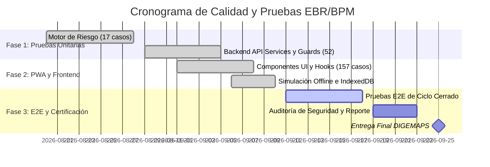

# 01 - Master Test Plan (Plan Maestro de Pruebas)
**Sistema PWA de Evaluación Basada en Riesgo (EBR/BPM)**  
**Cliente:** Ministerio de Salud Pública — DIGEMAPS / DPS / DAS  
**Versión del Documento:** 1.0  
**Fecha:** Septiembre 2026  
**Responsable:** Rol QA / BA / DevOps  

---

## 1. Introducción y Propósito
El propósito de este Plan Maestro de Pruebas es definir el alcance, enfoque, recursos, cronograma y criterios de aceptación para las pruebas del Sistema PWA de Evaluación Basada en Riesgo (EBR/BPM). El sistema digitaliza la inspección de Buenas Prácticas de Manufactura en establecimientos de alimentos bajo un modelo de ciclo cerrado y arquitectura *offline-first*.

---

## 2. Alcance de las Pruebas (Scope)

### 2.1 En Alcance (In-Scope)
- **Motor de Riesgo (`packages/risk-engine`):**
  - Validación matemática de la Ficha BPM (45 criterios evaluables).
  - Exclusión estricta de respuestas "No Aplica" ($N/A$) del denominador efectivo.
  - Reglas de aprobación (umbral $> 60\%$, no conformidades críticas $\le 1$, mayores $\le 5$) y otorgamiento de Permiso Sanitario ($> 81\%$).
  - Ponderación de los 6 factores de establecimiento ($RE$, peso 0.56 en factor BPM).
  - Cálculo de Riesgo de Producto ($RP = \max(\text{categorías})$).
  - Cálculo de Riesgo Total ($RT = RP \times RE$) y asignación de frecuencia (Anual, Semestral, Trimestral).
- **PWA Frontend (`apps/web`):**
  - Registro y ciclo de vida del Service Worker (Workbox).
  - Almacenamiento local estructurado en IndexedDB (`Dexie.js`).
  - Funcionamiento 100% offline (modo avión) y cola de sincronización diferida (`Outbox`).
  - Captura y compresión local de evidencias fotográficas en el cliente.
  - Vistas y dashboards según roles (Técnico, Coordinador, Empresa, Administrador).
- **Backend API (`apps/api`):**
  - Autenticación JWT, rotación criptográfica de refresh tokens y revocación en cascada ante reuso.
  - Control de acceso por roles (RBAC) con `RolesGuard`.
  - Aislamiento multi-empresa con `EmpresaOwnershipGuard` (prevención de IDOR).
  - Integridad transaccional y bloqueo estricto de evaluaciones finalizadas (`RF-17`).
  - Búsqueda histórica con filtros avanzados y seguridad a nivel de servidor.
- **Base de Datos (PostgreSQL 18 + Prisma):**
  - Integridad referencial de las 51 tablas del esquema oficial.
  - Carga y consistencia de catálogos iniciales y semillas (Excel DIGEMAPS).

### 2.2 Fuera de Alcance (Out-of-Scope)
- Pruebas de penetración física en instalaciones de DIGEMAPS.
- Integración con pasarelas de pago (no aplica al alcance del SRS).
- Pruebas de estrés a más de 10,000 usuarios concurrentes (el universo estimado de inspectores es $< 100$).

---

## 3. Entornos de Prueba (Test Environments)

| Componente | Entorno de Pruebas Local | Entorno Integrado CI/CD |
|---|---|---|
| **Sistema Operativo** | Windows 11 Pro / x64 | Ubuntu 22.04 LTS (GitHub Actions) |
| **Node.js** | v24.13.0 / npm 11.6.2 | v20.x LTS |
| **Base de Datos** | PostgreSQL 18.3 (puerto 5432) | PostgreSQL 16 (Service Container) |
| **Navegadores** | Google Chrome 128+, Microsoft Edge, Firefox | Headless Chromium (Playwright) |
| **Simulación Offline** | Chrome DevTools Network Throttling / Airplane Mode | Vitest Fake-IndexedDB + Mock Service Worker |

---

## 4. Recursos y Responsabilidades

| Rol | Responsabilidades QA |
|---|---|
| **Lead QA / Ingeniero de Pruebas** | Diseño del plan maestro, definición de casos de prueba, ejecución de pruebas exploratorias y certificación final. |
| **Desarrollador Backend** | Implementación y mantenimiento de pruebas unitarias/integración en Jest, corrección de defectos en API. |
| **Desarrollador Frontend** | Mantenimiento de pruebas en Vitest, soporte a escenarios de prueba offline y sincronización. |
| **Product Owner / DIGEMAPS** | Aprobación de criterios de aceptación y resolución de ambigüedades de negocio. |

---

## 5. Cronograma de Pruebas (Test Schedule)

---

## 6. Riesgos y Mitigación

| Riesgo | Probabilidad | Impacto | Estrategia de Mitigación |
|---|---|---|---|
| Pérdida de datos en inspección offline por cierre accidental del navegador. | Alta | Crítico | Persistencia inmediata en Dexie (`IndexedDB`) con cada cambio de campo antes de enviar. |
| Divergencia entre el motor de riesgo web y el motor de backend. | Media | Crítico | Paquete único agnóstico `@ebr/risk-engine` importado idénticamente por cliente y servidor. |
| Intento de alteración de acta de inspección ya emitida. | Baja | Crítico | Bandera `bloqueada = true` en base de datos; triggers y guards que rechazan mutaciones post-envío. |
| Ambigüedad en conversión de escala 2-8 de alimentos a riesgo Bajo/Medio/Alto (A-01). | Media | Alto | Configuración de rangos materializada en tabla `rango_nivel_riesgo` con `es_supuesto = true` parametrizable sin recompilar. |
